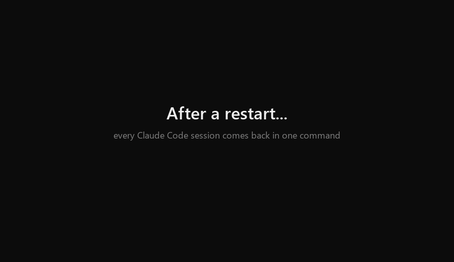

# Session Restore for Claude Code

Restarted Windows, or closed the terminal with Claude Code sessions still open? Start Claude once, type
`/session-restore:restore`, and every session you had open comes back in its own Windows Terminal tab: in the same
folder, in the same shell, with the conversation resumed.



## Install

In Claude Code:

```
/plugin marketplace add themidnightgospel/session-restore
/plugin install session-restore@session-restore
```

Sessions are tracked from the next time they start, so restart the ones you have open.

## Use

After a reboot, open a terminal, start `claude` in any folder, and run:

```
/session-restore:restore
```

| Command | What it does |
|---|---|
| `/session-restore:restore` | Reopen the closed sessions used in the last 7 days |
| `/session-restore:restore list` | Show every tracked session with its number, folder, title and status |
| `/session-restore:restore all` | Reopen every closed session, however old |
| `/session-restore:restore 1,3` | Reopen sessions #1 and #3 from the list |
| `/session-restore:restore forget 2` | Stop tracking session #2 without reopening it |

`list` numbers sessions 1, 2, 3… with the most recently used first. Numbers you type afterwards refer to that list,
even if you use other sessions in the meantime.

`/restore` works as a shorthand when no other installed skill uses that name.

## How it works

- **Tracking.** When an interactive session starts, a hook records its ID, folder, shell, permission flags and process
  in the plugin's data folder.
- **What counts as closed.** Ending a session on purpose (`/exit`, Ctrl+C or Ctrl+D, `/clear`, `/resume` to another
  session, logout) removes it from the list. Closing the window, a crash or a reboot leaves it there, so it can be
  reopened.
- **Restoring.** Each closed session opens in a new Windows Terminal tab running `claude --resume <id>` in its folder,
  in the shell it was started from (cmd, Windows PowerShell or PowerShell 7), with the permission flags it was started
  with, such as `--dangerously-skip-permissions`.
- **Clean tabs.** Tabs start with your normal login environment, the same as a tab you open yourself, not with the
  variables Claude Code sets for its own shells (`CLAUDECODE`, `NO_COLOR`, `GIT_EDITOR=true` and others).
- **No duplicates.** Sessions that are still running are skipped, judged by process ID and start time, and so are
  sessions some process is already resuming.
- **Only real terminal sessions.** `claude -p`, SDK, IDE-extension, Claude Desktop and background sessions aren't
  tracked.

## What it runs and stores

- **On every session start and end**, a PowerShell script (`scripts/tracker.ps1`) runs. It reads the list of running
  processes to find the shell Claude Code was started from and the permission flags it was started with.
- **It stores** one small JSON file per tracked session in the plugin's data folder on your machine: the session ID,
  folder, shell, permission flags, process ID and start time, and the transcript's path. Nothing else is kept.
- **The restore command** reads those files, the end of each session's transcript (for its title) and the list of
  running processes, then opens Windows Terminal tabs running `claude --resume`. It reuses only the permission flags a
  session was started with and never adds any.
- **Nothing is sent anywhere.** The plugin makes no network requests.

## Requirements

- Windows 10 or 11.
- Windows Terminal. Without it, each session opens in its own console window instead of a tab.
- Nothing else: the scripts run on the Windows PowerShell 5.1 built into Windows.
- Tested with Claude Code 2.1.288.

## Limitations

- You need one Claude session open to run the command.
- It opens tabs; it doesn't restore split panes or the arrangement of several windows.
- Sessions started from Git Bash or other shells reopen in PowerShell. Claude Code running inside WSL isn't supported.
- A session closed with the window's X stays tracked. Sessions unused for over 7 days are skipped unless you use `all`
  or their number, and entries unused for over 30 days are dropped, since Claude Code deletes those transcripts by
  default.
- A session in which nothing was typed has no conversation to resume, so a fresh `claude` starts in its folder.
- Claude Code asks "Do you trust this folder?" when a session opens in a folder you haven't trusted, and it never
  remembers trust for your home folder. A restored session in such a folder waits at that prompt.
- It relies on Claude Code details that aren't part of its documented interface: the `CLAUDE_PID`,
  `CLAUDE_CODE_ENTRYPOINT` and `CLAUDE_CODE_SESSION_KIND` environment variables, and the title lines in transcripts. A
  Claude Code update could change them; please open an issue if something stops working.

## Uninstall

```
/plugin uninstall session-restore@session-restore
```

This removes the hooks, the command and the list of tracked sessions.

## Development

| File | What it does |
|---|---|
| `hooks/hooks.json` | Runs the tracker when a session starts and ends |
| `scripts/tracker.ps1` | The hook's entry point |
| `scripts/SessionTracker.ps1` | What the hook records: shell, permission flags, session switches |
| `scripts/SessionStore.ps1` | Reading and writing the per-session files, shared by the hook and the command |
| `skills/restore/SKILL.md` | The `/session-restore:restore` command |
| `skills/restore/scripts/restore.ps1` | The command's entry point |
| `skills/restore/scripts/SessionRestore.ps1` | Listing, choosing and reopening sessions |

- Each script has a test file of the same name in `tests`. Tests use [Pester](https://pester.dev) 5 or later and run
  in both Windows PowerShell 5.1 and PowerShell 7: `Invoke-Pester tests`.
- To try local changes, add your clone as a marketplace (`/plugin marketplace add C:\path\to\session-restore`) and
  install from it. A plugin from a local marketplace loads in place, so new sessions pick up your edits.
- Keep the `.ps1` files ASCII-only: Windows PowerShell 5.1 reads scripts without a byte order mark as ANSI.

## License

[MIT](LICENSE). Not affiliated with or endorsed by Anthropic.
